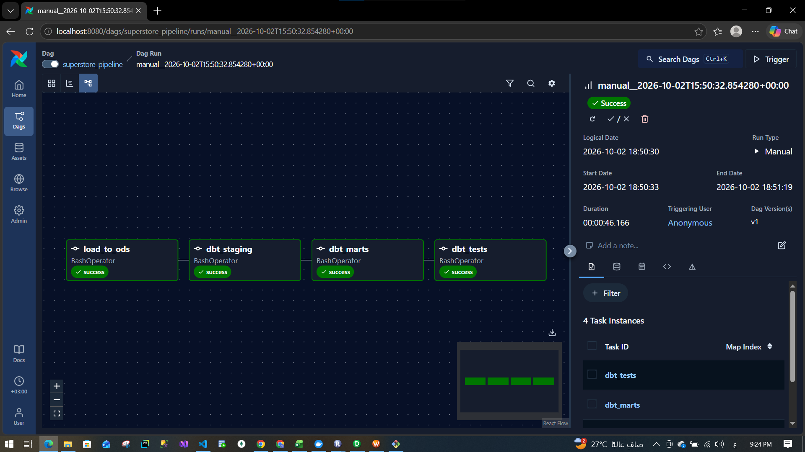

# Superstore Modern Data Engineering Pipeline

An end-to-end modern data engineering pipeline built on the Superstore dataset using DuckDB, dbt, Apache Airflow, Docker, Python, and SQL.

The pipeline loads raw Superstore data into an ODS layer, transforms it through dbt staging models, builds a star schema, validates data quality with dbt tests, and orchestrates the full workflow with Apache Airflow.

---

## Architecture

- [View Architecture Diagram](docs/architecture.md)
- [View Star Schema Diagram](docs/star_schema.md)


```text
Superstore CSV
      |
      v
Python Loader
      |
      v
DuckDB ODS Layer
      |
      v
dbt Staging
      |
      v
dbt Marts
      |
      +---------------------------+
      |                           |
      v                           v
Dimensions                 Fact Order Line
      |                           |
      +-------------+-------------+
                    |
                    v
               Star Schema
                    |
                    v
                dbt Tests

        Orchestrated by Airflow
```


---

## Tech Stack

- Python
- SQL
- DuckDB
- dbt Core
- dbt-duckdb
- dbt-utils
- Apache Airflow
- Docker
- Docker Compose

---

## Dataset

The project uses the Superstore dataset.

- **Rows:** 9,994
- **Columns:** 21
- **Grain:** one row per order line

Raw input:

```text
data/superstore.csv
```

---

## Pipeline Layers

### 1. ODS Layer

The Python loader reads the raw CSV and loads it into DuckDB:

```text
ods.orders
```

Loader:

```text
scripts/load_to_ods.py
```

The ODS layer preserves the source data with minimal transformation.

### 2. Staging Layer

dbt transforms the ODS data into:

```text
main_staging.stg_orders
```

The staging layer:

- standardizes column names
- preserves row-level grain
- prepares the data for dimensional modelling

Example:

```text
Order ID       -> order_id
Customer Name  -> customer_name
Sub-Category   -> sub_category
```

### 3. Marts Layer

The marts layer implements the analytical star schema.

---

## Star Schema

### Dimensions

- `dim_customer`
- `dim_product`
- `dim_location`
- `dim_date`
- `dim_ship_mode`
- `dim_segment`

### Fact Table

- `fact_order_line`

The fact grain is:

```text
one row per order line
```

Final fact row count:

```text
9,994
```

---

## Surrogate Keys

Hashed surrogate keys are generated using:

```text
dbt_utils.generate_surrogate_key
```

Example:

```sql
{{ dbt_utils.generate_surrogate_key(['customer_id']) }}
```

Unlike sequence-based keys such as `ROW_NUMBER()`, deterministic hashed keys remain stable across rebuilds when the business-key values remain unchanged.

---

## Product Dimension Data Quality Finding

During dbt testing, the project discovered an important modelling issue.

Some `product_id` values were associated with multiple different product names.

For example:

```text
FUR-CH-10001146
```

was associated with more than one product description.

Initially, the product surrogate key was generated only from:

```text
product_id
```

This caused duplicate `product_key` values.

The final product dimension grain was therefore defined using:

```text
product_id
+ product_name
+ category
+ sub_category
```

The final surrogate key is generated from all four fields.

This ensures that distinct product records sharing the same source `product_id` receive different surrogate keys.

---

## Data Quality Tests

dbt tests validate the staging and marts layers.

Tests include:

- `not_null`
- `unique`
- `relationships`

Examples:

```text
row_id must be unique
customer_key must not be null
product_key must be unique
fact.customer_key must exist in dim_customer
fact.product_key must exist in dim_product
```

Final test suite:

```text
41 dbt data tests
```

The successful end-to-end pipeline run completed with all tests passing.

---

## Airflow Orchestration

### Successful Pipeline Run

The following Airflow DAG run completed successfully end-to-end:



Apache Airflow orchestrates the complete pipeline.

DAG:

```text
superstore_pipeline
```

Workflow:

```text
load_to_ods
    |
    v
dbt_staging
    |
    v
dbt_marts
    |
    v
dbt_tests
```

### `load_to_ods`

Runs:

```bash
python scripts/load_to_ods.py
```

### `dbt_staging`

Runs:

```bash
dbt run --select stg_orders
```

### `dbt_marts`

Builds:

```text
dim_customer
dim_product
dim_location
dim_date
dim_ship_mode
dim_segment
fact_order_line
```

### `dbt_tests`

Runs:

```bash
dbt test
```

If an upstream task fails, Airflow prevents dependent downstream tasks from running.

---

## Docker

Docker provides a reproducible execution environment.

### Pipeline Image

Contains:

```text
Python
DuckDB
pandas
dbt-core
dbt-duckdb
```

### Airflow Image

Contains:

```text
Apache Airflow
DuckDB
dbt-core
dbt-duckdb
Git
```

---

## Project Structure

```text
superstore-modern-data-pipeline/
|
├── airflow/
│   └── dags/
│       └── superstore_pipeline.py
|
├── data/
│   └── superstore.csv
|
├── dbt/
│   ├── profiles/
│   │   └── profiles.yml
│   |
│   └── superstore_dbt/
│       ├── models/
│       │   ├── staging/
│       │   │   ├── sources.yml
│       │   │   ├── stg_orders.sql
│       │   │   └── stg_orders.yml
│       │   |
│       │   └── marts/
│       │       ├── dim_customer.sql
│       │       ├── dim_product.sql
│       │       ├── dim_location.sql
│       │       ├── dim_date.sql
│       │       ├── dim_ship_mode.sql
│       │       ├── dim_segment.sql
│       │       └── fact_order_line.sql
│       |
│       ├── dbt_project.yml
│       └── packages.yml
|
├── scripts/
│   ├── excel_to_csv.py
│   ├── load_to_ods.py
│   ├── check_ods.py
│   └── validate_ods.py
|
├── Dockerfile
├── Dockerfile.airflow
├── docker-compose.yml
├── requirements.txt
├── .gitignore
└── README.md
```

---

## Running the Project

### 1. Build the Docker Images

```bash
docker compose build
```

### 2. Start Airflow

```bash
docker compose up -d airflow
```

### 3. Open Airflow

```text
http://localhost:8080
```

### 4. Trigger the DAG

Run:

```text
superstore_pipeline
```

The pipeline executes:

```text
CSV
 ↓
ODS
 ↓
Staging
 ↓
Marts
 ↓
Tests
```

---

## Validation Results

The pipeline preserves the source grain across all major layers:

```text
ODS rows:     9,994
Staging rows: 9,994
Fact rows:    9,994
```

This confirms that no order-line records were lost or duplicated during the transformations.

---

## Key Learnings

- Data quality tests should be part of the pipeline, not an afterthought.
- A source business key is not always sufficient to define dimensional grain.
- Hashed surrogate keys provide deterministic identifiers across rebuilds.
- Airflow provides orchestration and failure handling while dbt handles transformations and testing.
- Docker makes the full environment reproducible.

---

## Author

Youssef Shaaban